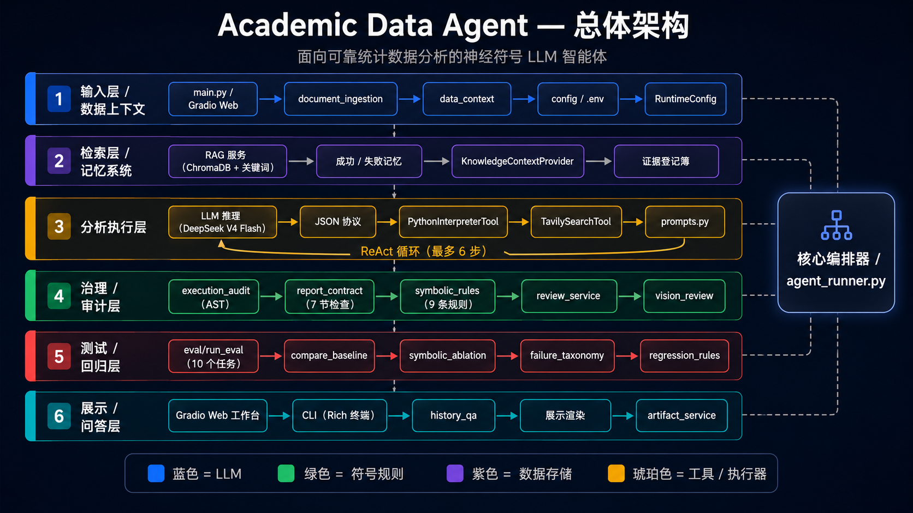
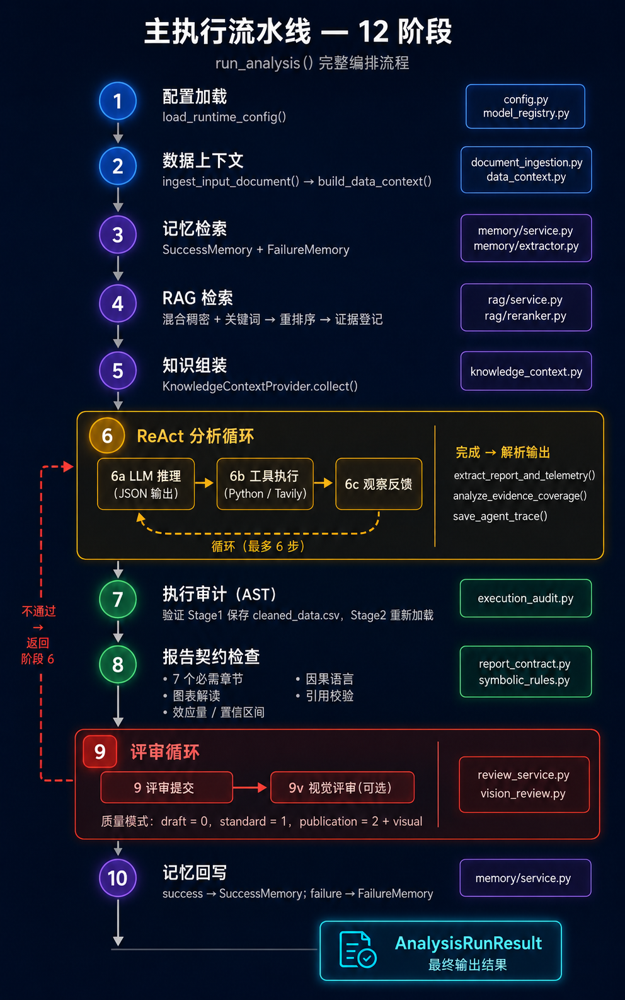
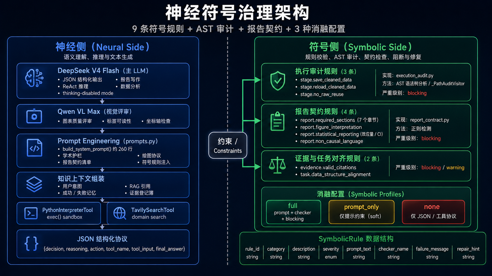
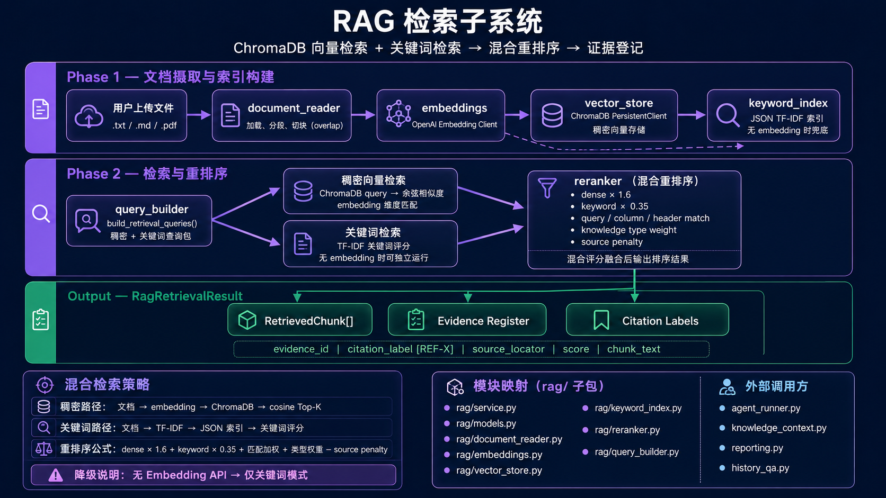
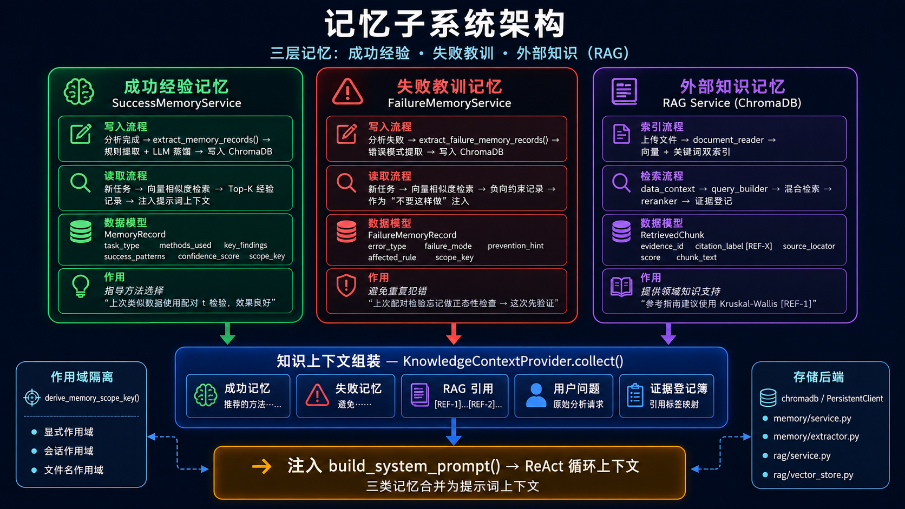
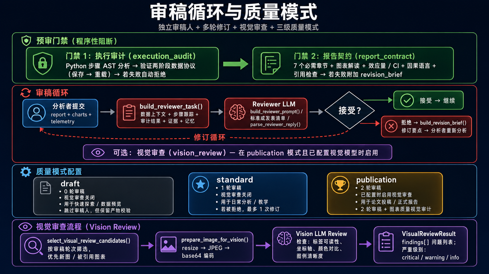
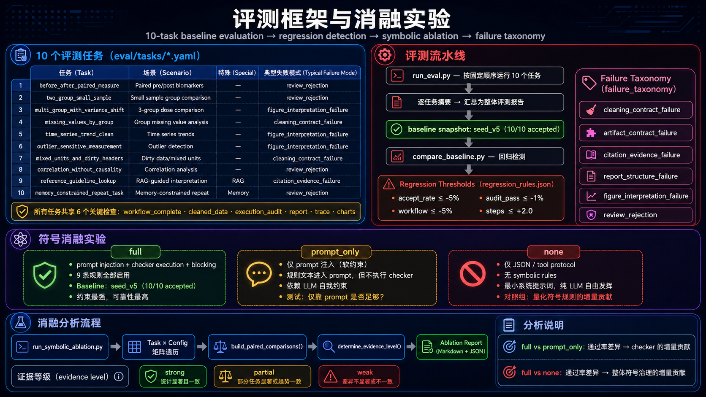

<div align="center">
<h1>Academic-Data-Agent</h1>

**面向科研与学术场景的结构化数据分析智能体工作台**

[](https://www.python.org/downloads/)
[](#)

[特点](#-核心特点) · [图览](#-架构图览) · [架构](#-系统架构) · [快速开始](#-快速开始) · [使用指南](#-使用指南) · [项目结构](#-项目结构)
</div>

## 项目简介
**Academic-Data-Agent** 是一个基于 `hello-agents` 二次开发的科研表格分析智能体工作台。当前正式主线是“**结构化表格数据分析 + 可审计报告生成 + 历史结果追问**”，重点不是做通用聊天 Agent，而是把科研数据分析流程做成可运行、可追溯、可审稿、可回归验证的工程闭环。

本项目实现了一个带有神经符号思想的可靠数据分析 LLM Agent。更准确地说，它是一个 **neuro-symbolic-inspired LLM agent for reliable statistical data analysis**：LLM、embedding、RAG 和 memory 负责语义理解、检索和生成，统计规则、JSON 协议、AST 审计、报告契约和 blocking check 负责约束、验证和返修。项目不宣称自己是完整的 neuro-symbolic learning system，也不引入逻辑推理器、知识图谱推理、规则学习或可微符号模块。

当前项目重点解决的是：

- 用户上传一份结构化表格数据
- 系统构建数据上下文，并按需引入本地参考资料与项目记忆
- analyst 通过受控 ReAct 循环调用 Python 完成清洗、统计、绘图和报告生成
- execution audit 强校验 `cleaned_data.csv` 的保存与后续重读，确保正式结果来自全量清洗数据
- report contract 与 reviewer 共同检查报告结构、统计解释、图表证据和引用可靠性
- 每次运行都会沉淀报告、图表、trace、review 和 run summary
- 历史问答可以围绕既有运行结果继续解释、对比和复盘

当前项目支持：

- 表格数据输入：`csv / xls / xlsx`
- 受控分析工作流：工具调用、运行轨迹、异常回退与审稿返修
- 工程化 RAG：查询改写、混合检索、结构化切块、重排与证据登记
- 阶段执行审计：强校验 `cleaned_data.csv` 的生成与重读
- 共享 report contract：统一检查报告结构、图表解释、统计假设、效应量、置信区间和引用覆盖
- 成功经验 / 失败教训 / 外部参考资料分层存储
- 历史问答：围绕历史运行结果做单次追问或跨运行对比
- Gradio 工作台、历史回放与工件下载
- eval harness：固定 10 个自造表格任务，当前 `seed_v5` 稳定基线为 `10/10 accepted`
- symbolic ablation：支持 `full`、`prompt_only`、`none` 三组 profile，对比符号化规则和验证反馈对流程合规性、报告完整性和可复现性的影响

## 架构图览

以下 SVG 图均位于 [`diagrams/`](./diagrams/) 目录，可在 GitHub README 中直接缩放查看，也可以通过 [`diagrams/viewer.html`](./diagrams/viewer.html) 本地浏览整套图集。

### 1. 总体六层架构



### 2. 主执行流水线



### 3. Neuro-Symbolic 治理架构



### 4. RAG 检索子系统



### 5. 记忆子系统



### 6. 审稿循环与质量模式



### 7. 评测框架与消融实验



### 适用场景

- 学术或科研表格数据的自动清洗、统计分析与报告生成
- 需要保留图表、轨迹、审稿记录和历史回放的分析任务
- 希望对历史分析结果继续提问、对比和复盘的项目型工作流
- 希望通过固定 eval baseline 持续验证分析链路稳定性的实验型项目

---

## 核心特点

### 1. 稳定基线：seed_v5 作为当前回归对照

- 当前固定 10 任务 eval 已形成稳定基线：`eval/baselines/seed_v5.json`
- `seed_v5` 结果为 `10/10 accepted`、`workflow_complete_rate=1.0`、`execution_audit_pass_rate=1.0`
- 后续改动默认对照 `seed_v5`，优先检查真实失败 run，而不是扩大 prompt 面积
- harness 覆盖两组比较、缺失值、异常值、多组比较、时间趋势、相关性、RAG 和 Memory

### 2. 主线清晰：聚焦结构化表格分析

- 当前正式输入主线只面向结构化表格数据
- 上传后直接进入数据上下文构建、检索增强、分析执行与审稿流程
- 仓库中仍保留部分旧的 PDF 兼容代码，但 PDF 已不再是当前版本的正式入口主线

### 3. 受控分析，而不是自由聊天

- 分析主循环采用 **ReAct 风格**：逐步决策、调用工具、读取观察结果、继续推进
- 不是纯聊天式回答，也不是“先出完整计划再机械执行”的 plan-and-execute
- 外层还有执行审计、报告契约和审稿返修，因此整体更像“分析员 + 质检员 + 审稿人”

### 4. 真正基于全量数据分析

- `data_context` 只给模型提供字段、规模、样例等压缩摘要，负责“看懂这是什么数据”
- 正式统计分析和绘图必须通过 Python 工具重新读取本地文件完成
- 阶段执行审计会检查是否明确生成并重读 `cleaned_data.csv`
- 如果无法证明正式分析基于清洗后的全量数据，该轮不能通过审稿

### 5. 共享报告契约：把基础质量问题前置

- `report_contract` 在 reviewer 前统一检查报告结构、图表解释、统计假设、effect size、CI 和引用覆盖
- analyst 返修会收到结构化 revision brief，而不是只看 reviewer 的自然语言批评
- reviewer 更聚焦高层统计逻辑、证据匹配和解释边界，减少与 analyst 的标准错位

### 6. RAG 负责外部依据，不负责“记住一切”

- RAG 的职责是提供外部参考资料、背景知识和证据片段
- 它服务于分析解释、报告引用和历史问答检索底座
- 它不直接存放运行失败经验，也不替代项目记忆
- 当 embedding 未配置但提供了本地参考资料时，系统支持 keyword-only local RAG fallback

### 7. 记忆分层更清楚

- **成功经验**：只沉淀最终通过审稿、工作流完整的运行经验
- **失败教训**：单独沉淀完整失败运行中的负向约束和禁忌清单
- **外部参考资料**：单独进入知识库，用于 RAG 检索
- **运行档案**：每次运行都保留完整报告、轨迹、图表和审稿记录

### 8. 历史问答不是“重新分析一次”

- 历史问答读取的是历史运行工件，而不是重新执行新的数据分析代码
- 支持围绕某次运行解释方法、图表、结论和审稿意见
- 也支持跨多次运行做对比总结，并对非 `accepted` 的来源显式标注状态

### 9. 有工作台，不只是脚本

- Web 工作台支持发起分析、查看结果、浏览历史与继续追问
- 自动保存报告、图表、轨迹、审稿记录和知识库状态
- 支持历史记录浏览与工件下载，便于复盘和展示

---

## 系统架构

当前项目可以理解为六层结构：

### 1. 输入与数据上下文层

- 接收结构化表格输入
- 构建 `data_context`
- 提供字段、类型、规模、样例行和数据警告

### 2. 检索与记忆层

- 成功经验检索：提供正向做法、稳定偏好和已验证约束
- 失败教训检索：提供负向约束、常见错误和额外检查项
- RAG 检索：提供外部参考资料和证据片段

### 3. 分析执行层

- `run_analysis(...)` 串联整条主链路
- analyst loop 负责多步分析与工具调用
- Python 工具执行真实的数据清洗、统计和绘图

### 4. 治理与审计层

- execution audit：检查是否真的基于 `cleaned_data.csv` 做正式分析
- report contract：检查报告结构、统计契约、图表解释和证据引用
- reviewer：检查结论、图表、证据与引用是否可靠
- artifact validation：检查关键工件是否完整

### 5. Harness 与回归验证层

- `eval/tasks/*.yaml` 固定 10 个自造科研表格任务
- `eval/scripts/run_eval.py` 统一运行任务、保存 summary、生成 baseline
- 当前稳定基线为 `seed_v5`，后续改动默认以它作为回归对照

### 6. 展示与追问层

- CLI 负责命令行运行
- Gradio 工作台负责上传、结果展示、历史回放和历史问答

---

## 快速开始
### 环境要求

- Python 3.10+
- 建议使用虚拟环境

### 安装依赖

```bash
pip install -r requirements.txt
```

### 配置环境变量

在项目根目录创建 `.env` 文件：

```env
LLM_MODEL_ID=mimo-v2.5
LLM_BASE_URL=https://token-plan-cn.xiaomimimo.com/anthropic
LLM_API_KEY=your_api_key_here
LLM_TIMEOUT=120

# 可选：联网搜索
TAVILY_API_KEY=your_tavily_api_key_here

# 可选：向量检索、成功经验、失败教训、历史问答检索
EMBEDDING_MODEL_ID=text-embedding-3-small
EMBEDDING_BASE_URL=https://api.openai.com/v1
EMBEDDING_API_KEY=your_embedding_api_key
EMBEDDING_TIMEOUT=120

# 可选：视觉审稿
VISION_LLM_MODEL_ID=your_vision_model
VISION_LLM_BASE_URL=https://your-vision-endpoint/v1
VISION_LLM_API_KEY=your_vision_api_key
VISION_LLM_TIMEOUT=120
```

主文本模型当前示例使用小米 MiMo 的 Anthropic Messages 兼容接口。若改回 DeepSeek endpoint，运行时仍会把 `deepseek-chat`、`deepseek-reasoner` 或 `deepseek-v4-pro` 等 DeepSeek 文本模型归一化到 `deepseek-v4-flash`，并显式关闭 thinking。

### 命令行运行
分析表格：

```bash
python main.py --data data/simple_data.xlsx
```

### 启动 Web 工作台

```bash
python gradio_app.py
```

---

## 使用指南

### CLI 常用参数

- `--data`
- `--output-dir`
- `--query`
- `--quality-mode`
- `--latency-mode`
- `--vision-review-mode`
- `--vision-max-images`
- `--vision-max-image-side`

### 质量模式

- `draft`：不走审稿，直接输出草稿
- `standard`：默认允许 1 轮返修
- `publication`：默认允许 2 轮返修，并可自动启用视觉审稿

### Python API

```python
from pathlib import Path

from data_analysis_agent.agent_runner import run_analysis

result = run_analysis(
    Path("data/simple_data.xlsx"),
    quality_mode="standard",
    latency_mode="auto",
    use_rag=True,
    use_memory=True,
    memory_scope_key="demo-project",
)

print(result.report_path)
print(result.trace_path)
print(result.review_status)
print(result.rag_status)
print(result.memory_writeback_status)
print(result.failure_memory_writeback_status)
```

### Web 工作台能力

- 上传结构化表格
- 上传可沉淀的参考资料
- 配置是否启用外部参考资料检索
- 配置是否启用成功经验 / 失败教训回忆
- 查看实时进度、结果摘要、图表和审稿状态
- 浏览历史记录并继续追问

### 文档索引

- [核心代码学习手册](./docs/核心代码学习手册.md)
- [项目概念审计](./docs/项目概念审计.md)
- [项目改进路线图](./docs/项目改进路线图.md)
- [项目主链路拆解](./docs/项目主链路拆解.md)
- [令牌、上下文与审稿说明](./docs/令牌、上下文与审稿说明.md)
- [Harness seed_v4 / seed_v5 迭代总结](./docs/harness_seed_v4_iteration_summary.md)

---

## 项目结构

```text
.
├── data/                          示例数据
├── docs/                          技术说明与学习文档
├── eval/                          固定评测任务、baseline 与回归脚本
├── memory/                        外部参考资料库、成功经验与失败教训
├── outputs/                       运行产物与 Web 上传缓存
├── src/
│   └── data_analysis_agent/
│       ├── agent_runner.py        主分析流程与编排入口
│       ├── artifact_service.py    工件落盘与运行元数据汇总
│       ├── config.py              运行配置
│       ├── data_context.py        数据上下文构建
│       ├── execution_audit.py     全量数据使用阶段审计
│       ├── history_qa.py          历史问答服务
│       ├── knowledge_context.py   记忆 / RAG / 证据注入层
│       ├── prompts.py             Analyst / Reviewer Prompt
│       ├── reporting.py           报告提取、引用解析与落盘
│       ├── report_contract.py     共享报告契约与返修 brief
│       ├── review_service.py      审稿任务构建与日志落地
│       ├── rag/                   外部参考资料检索子系统
│       ├── memory/                成功经验与失败教训子系统
│       ├── vision_review.py       视觉审稿
│       └── web/                   Gradio 工作台
├── tests/                         单元测试
├── gradio_app.py                  Web 启动入口
├── main.py                        CLI 入口
├── requirements.txt
└── README.md
```

---

## 运行产物

每次运行都会在 `outputs/run_YYYYMMDD_HHMMSS/` 下生成独立工件，常见内容包括：

```text
outputs/run_YYYYMMDD_HHMMSS/
├── data/
│   └── cleaned_data.csv
├── figures/
├── logs/
│   ├── agent_trace.json
│   ├── review_round_1_review.json
│   └── review_round_1_visual_review.json
├── review_round_1_report.md
└── final_report.md
```

`agent_trace.json` 当前会记录：

- 工作流状态与事件流
- analyst 每步工具调用摘要
- Python 工具的完整输入代码
- 阶段执行审计结果
- report contract 检查结果
- RAG 检索与证据登记摘要
- 成功经验 / 失败教训的检索与写回状态
- 审稿历史与最终结论

---

## Eval 基线

当前固定 harness 包含 10 个任务：

```text
before_after_paired_measure
correlation_without_causality
memory_constrained_repeat_task
missing_values_by_group
mixed_units_and_dirty_headers
multi_group_with_variance_shift
outlier_sensitive_measurement
reference_guideline_lookup
time_series_trend_clean
two_group_small_sample
```

当前稳定基线：

```text
baseline: seed_v5
task_count: 10
accepted: 10/10
workflow_complete_rate: 1.0
execution_audit_pass_rate: 1.0
review_reject_rate: 0.0
```

后续开发默认使用 `seed_v5` 作为回归对照。若出现失败，优先检查对应 run 的 report、trace、review log 和 contract summary，再做最小修复。

---

## 当前边界

- 当前默认正式入口只支持结构化表格数据，不再把 PDF 作为正式输入主线
- 历史问答只读取历史工件，不会重新执行新的数据分析代码
- 联网搜索、向量检索和视觉审稿依赖外部模型或 API 配置
- 当前更像“分析工作台 + 历史追问系统”，不是通用多工具智能体平台
