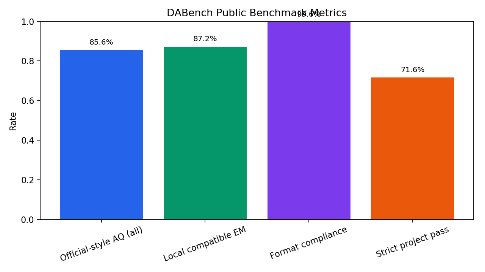
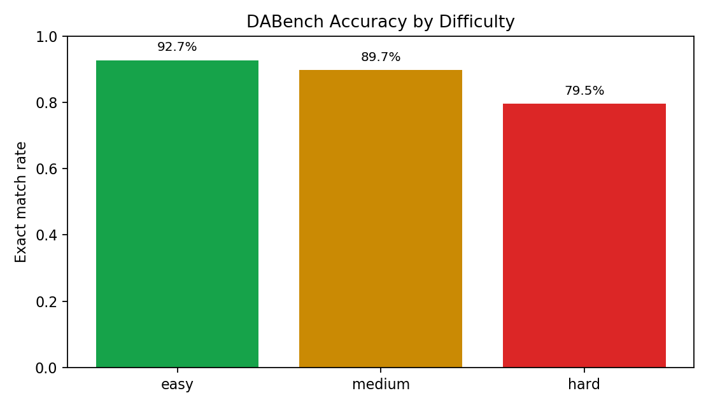
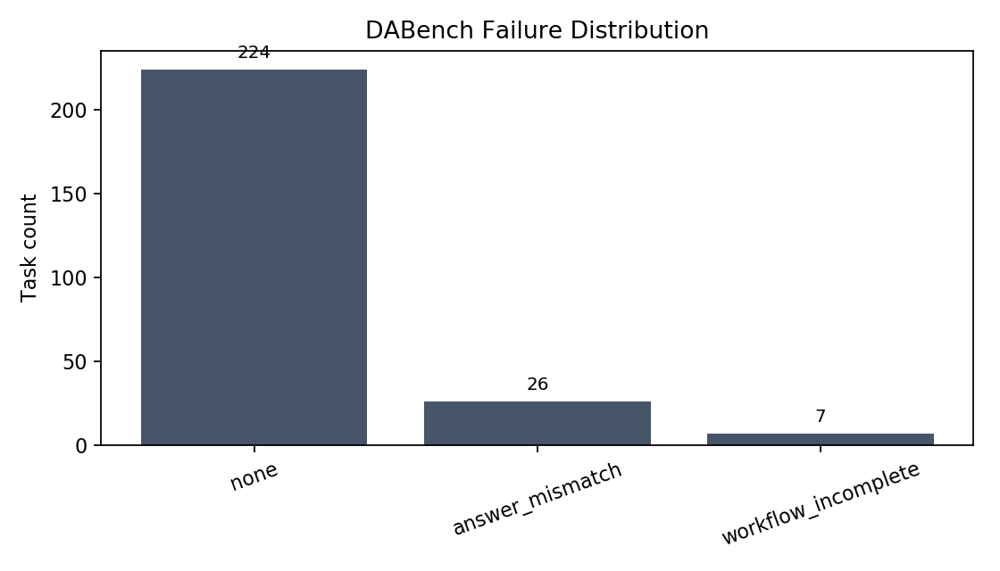

# DABench Public Benchmark Result

This report summarizes a local reproduction run of Academic-Data-Agent on the currently public InfiAgent-DABench closed-form dev files.

## Key Takeaways

- Current public files contain `257` labeled closed-form tasks, not the `311` questions stated on the DABench website leaderboard page.
- Official-style Accuracy by Question is `85.60%` when empty responses count as failures, or `85.94%` over non-empty matched responses.
- Local compatible exact match is `87.16%` (`224/257`), because it normalizes minor case/quote differences for diagnosis.
- Strict project pass is `71.60%`, preserving Academic-Data-Agent workflow/audit constraints as a separate reliability signal.

## Metric Table

| Metric | Value | Notes |
| --- | ---: | --- |
| Official-style Accuracy by Question (all labels) | 85.60% | Closest local reproduction of official evaluator semantics |
| Official-style Accuracy by Question (matched non-empty) | 85.94% | Official script skips empty responses |
| Official-style Accuracy by Sub-question | 88.33% | Metric-level correctness |
| Local compatible exact match | 87.16% | Normalizes case/quote differences |
| Format compliance | 99.61% | DABench answer tag extraction success |
| Workflow complete | 81.71% | Project artifact/workflow contract |
| Execution audit pass | 94.16% | Project cleaned-data audit |
| Average duration | 32.84s/task | Local run timing |

## Cautious Public Baseline Comparison

| System / run | Accuracy by Question | Comparability |
| --- | ---: | --- |
| Academic-Data-Agent local run | 85.60%-85.94% | Current public 257-task files, local reproduction |
| GPT-4-0613 on DABench page | 78.72% | Website leaderboard, stated 311-question validation set |
| GPT-3.5-turbo-0613 on DABench page | 65.70% | Website leaderboard |
| DAAgent-34B on DABench page | 67.50% | Website leaderboard |

Do not describe this as an official leaderboard result or SOTA claim. The website, current GitHub files, and HuggingFace files have different task-count wording.

## Difficulty Breakdown

| Difficulty | Tasks | Exact matches | Rate |
| --- | ---: | ---: | ---: |
| easy | 82 | 76 | 92.68% |
| medium | 87 | 78 | 89.66% |
| hard | 88 | 70 | 79.55% |

## Failure Distribution

| Failure type | Count |
| --- | ---: |
| answer_mismatch | 26 |
| none | 224 |
| workflow_incomplete | 7 |

## Reproduction Notes

- Command: `python eval/scripts/run_dabench.py --full-validation --dabench-mode --env-file .env --vision-review-mode off`
- Data source checked against current public `da-dev-questions.jsonl` and `da-dev-labels.jsonl` from the InfiAgent-DABench assets.
- Full raw model reports and external benchmark data are intentionally excluded from git; use the local ignored `eval/reports/dabench/20260511_004214/` directory for forensic review.
